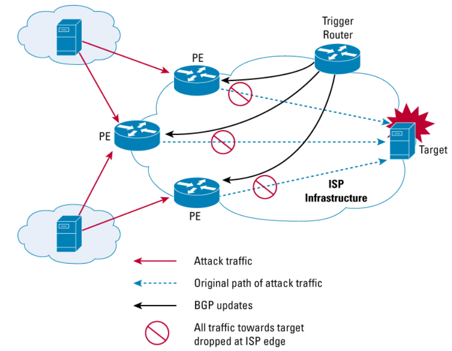

# Cisco_RTBH_Pusher
A toolset for implementing Remotely Triggered Black Hole (RTBH) filtering using Cisco routers and IP lists from https://iplists.firehol.org/.

## Prerequisites
Before using this tool, you need to:
1. Configure RTBH according to Cisco's manual:
   https://www.cisco.com/c/dam/en_us/about/security/intelligence/blackhole.pdf
2. Have a Cisco router with at least 2GB of RAM to be used as a TRIGGER router.

## What This Tool Does
1. Downloads IP lists from specified sources (default: https://iplists.firehol.org/)
2. Merges and deduplicates all lists into a single file
3. Converts the merged list into Cisco IOS commands
4. Deploys the commands to your TRIGGER router's running-config via FTP

## Installation Requirements
1. IPrange - for merging IP ranges from different lists
   - https://github.com/firehol/iprange

2. Netmiko library - for executing remote commands on the Cisco TRIGGER router
   - https://github.com/ktbyers/netmiko
   - Must be installed for the user who will execute the script

3. FTP server - either local or remote
   - Default configuration assumes a local FTP server

## Custom IP Lists
To permanently add your own IP addresses to the block list:
- Add them to '1_local_list.myset' in CIDR format

## Configuration
See the configuration files in the 'configs' directory for:
- IP list sources
- Cisco router settings
- FTP server settings
- Network exclusions
