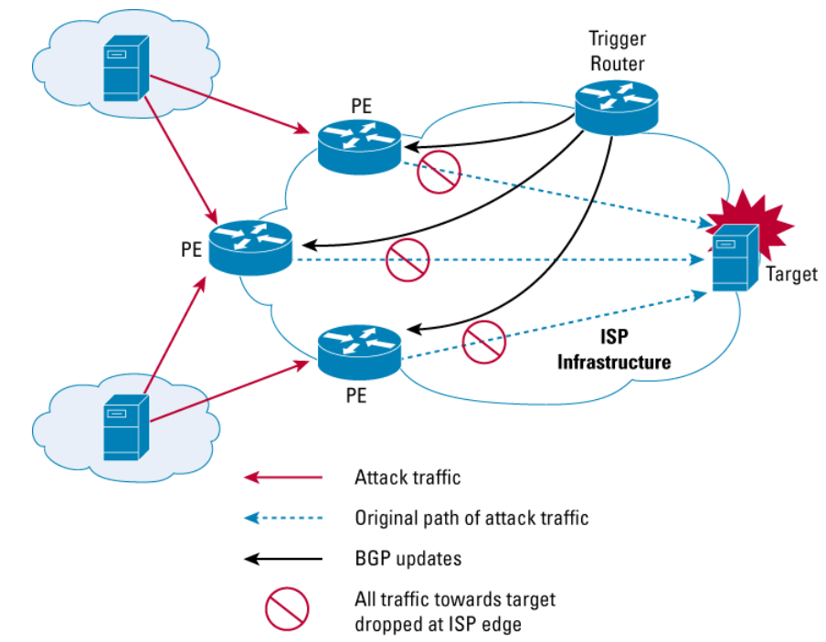

# Cisco RTBH Pusher
A tool for automated Remotely Triggered Black Hole (RTBH) filtering on Cisco routers. It downloads malicious IP lists and configures them as null routes on your router.

## Features
- Downloads IP blocklists from configurable sources
- Merges and deduplicates IP lists
- Supports exclusion of trusted networks
- Generates Cisco IOS null routing commands
- Automatically uploads and applies configuration to Trigger router
- Supports local IP lists via .myset files

## Prerequisites
1. Cisco router (virtual c8000v is ok) to work as a Trigger router with:
   - SSH and SCP enabled
   - At least 2GB RAM
   - Configured RTBH ([Cisco RTBH Guide](https://www.cisco.com/c/dam/en_us/about/security/intelligence/blackhole.pdf))

## Installation Requirements
1. Python 3.6+ with packages:
   - netaddr (for IP processing)
   - netmiko (for router communication)
   - paramiko (for SCP transfers)
   - aiohttp (for downloading IP lists)
   - configparser (for configuration handling)

## Configuration
1. Edit `configs/rtbh.conf` which contains:
   - Router connection settings in `[router]` section
   - IP blocklist URLs in `[blocklists]` section
   - Networks to exclude in `[exclude_networks]` section

Example configuration:
```ini
[router]
CISCO_HOST=192.168.1.1
CISCO_USERNAME=admin
CISCO_PASSWORD=secret
SCP_DESTINATION=bootflash:/cisco_commands.txt
INPUT_IP_LIST=ip_list.txt
OUTPUT_COMMANDS_FILE=cisco_commands.txt

[blocklists]
url1=https://iplists.firehol.org/files/firehol_level1.netset
url2=https://feodotracker.abuse.ch/downloads/ipblocklist_recommended.txt

[exclude_networks]
10.0.0.0/8
172.16.0.0/12
192.168.0.0/16
```

## Usage
Basic execution:
```
python3 rtbh_pusher.py
```

Test mode (no router upload):
```
python3 rtbh_pusher.py --no-upload
```

## Custom IP Lists
To permanently add your own IP addresses to the block list:
1. Create a file with `.myset` extension in `raw_lists/` directory
2. Add IP addresses in CIDR format (one per line)
3. Example: `raw_lists/custom_blocks.myset`

Example custom_blocks.myset:
```
1.2.3.0/24
2.3.4.0/24
5.6.7.8/32
```

## Security Notes
- Store `configs/rtbh.conf` securely - it contains credentials
- Review exclusion list carefully before deployment
- Test new IP lists with `--no-upload` first
- Use strong passwords for router access
- Consider using SSH keys instead of passwords
- Regularly update blocklists sources



## Benefits of RTBH (from cisco.com)
Benefits of Remotely Triggered Black Hole Filtering
Black holes, from a network security perspective, are placed in the network where traffic is forwarded and dropped. Once an attack has been
detected, black holing can be used to drop all attack traffic at the edge of an Internet service provide (ISP) network, based on either destination
or source IP addresses. RTBH filtering is a technique that uses routing protocol updates to manipulate route tables at the network edge or
anywhere else in the network to specifically drop undesirable traffic before it enters the service provider network.
RTBH filtering provides a method for quickly dropping undesirable traffic at the edge of the network, based on either source addresses or
destination addresses by forwarding it to a null0 interface. Null0 is a pseudointerface that is always up and can never forward or receive traffic.
Forwarding packets to null0 is a common way to filter packets to a specific destination.
